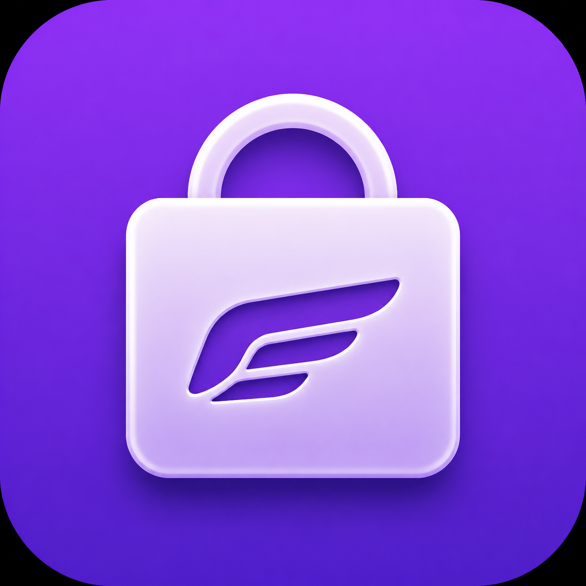

  

# AeroStore

> AeroStore is a **fork of [SideStore](https://github.com/SideStore/SideStore)**—an *untethered, community-driven* alternative app store for non-jailbroken iOS devices—with refreshed branding and on-device JIT via StikJIT.
>
> Full release date: July 1st 2026

**Repository:** [github.com/FluxStore-App/FluxStore](https://github.com/FluxStore-App/FluxStore) (GitHub org/repo name is unchanged; the installed app is **AeroStore**.)

In the app, **Settings → Advanced → Bundle ID presets** (with **Customize installed app bundle identifier** enabled) lets you save per-app bundle ID overrides used when sideloading.

Like SideStore, AeroStore resigns apps with your personal development certificate and uses [em_proxy](https://github.com/jkcoxson/em_proxy) so iOS can install them. Background refresh helps keep the usual 7-day development provisioning window from expiring unexpectedly.

## How to install (no git clone)

You do **not** need to clone this repository to use AeroStore on a device.

### Option A — GitHub Actions (unsigned IPA)

1. Open [**Actions → Get IPA (unsigned)**](https://github.com/FluxStore-App/FluxStore/actions/workflows/get-ipa.yml).
2. Click **Run workflow** on the `main` branch and wait for the job to finish.
3. Download the **`ipa-unsigned`** artifact (`App.ipa`).
4. Install the IPA with your usual sideloading flow (AltStore, SideStore, LiveContainer, TrollStore, etc.) and trust the developer certificate in **Settings → General → VPN & Device Management**.

### Option B — GitHub Releases

When a release is published, download **`AeroStore.ipa`** (or the latest `.ipa` asset) from [Releases](https://github.com/FluxStore-App/FluxStore/releases) and install it the same way as above.

### Optional — add the built-in source

After install, you can add the official catalog URL in **Browse → Add catalog**:

`https://raw.githubusercontent.com/FluxStore-App/FluxStore/main/AeroStore.source.json`

### Pairing file

On first launch, AeroStore may ask for a **pairing file** so it can refresh and install apps. You can **Browse without pairing** to explore sources only; add the file later under **Settings** when you are ready to install or refresh.

## How AeroStore differs from SideStore

| Area | SideStore (upstream) | AeroStore (this fork) |
|------|----------------------|------------------------|
| **Identity** | SideStore product name and assets | **AeroStore** (`com.aero.aerostore` bundle IDs — see `Build.xcconfig`) |
| **JIT / debugging** | Often discussed alongside **SideJITStreamer**-style enablers | **StikJIT** under `StikJIT/` for on-device JIT |
| **UI** | Upstream tabs and chrome | Browse / My Apps / Settings with a modern card layout |

Upstream SideStore remains a community fork of [AltStore](https://github.com/rileytestut/AltStore). AeroStore tracks that lineage under the AGPLv3 license.

## Requirements (developers only)

- **Xcode** 26.x
- **iOS** 14+ (check the active deployment target in Xcode)
- **Rustup** only if you build Rust components locally — see [CONTRIBUTING.md](./CONTRIBUTING.md)

## Project overview

- **Main app** — Xcode scheme **SideStore**, product **AeroStore.app**
- **EM Proxy**, **Minimuxer**, **StikJIT**, **Roxas** — same roles as in SideStore; see [CONTRIBUTING.md](./CONTRIBUTING.md) for building from source.

## Contributing

See [CONTRIBUTING.md](./CONTRIBUTING.md) if you want to build or hack on the project (clone + submodules required for development only).

## Licensing

AGPLv3 — see [LICENSE](LICENSE).
